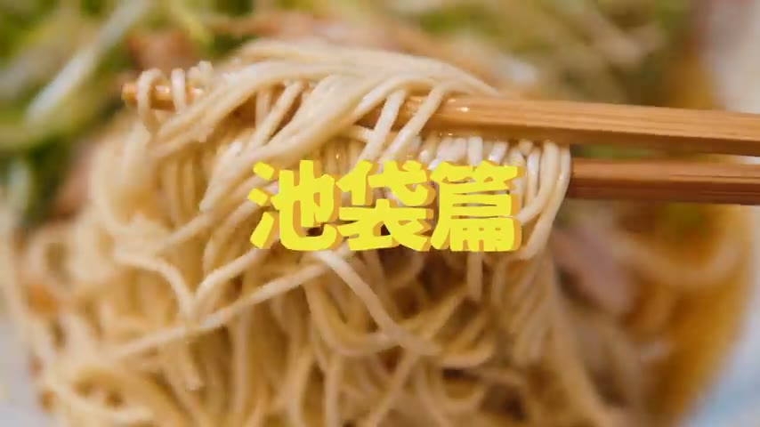
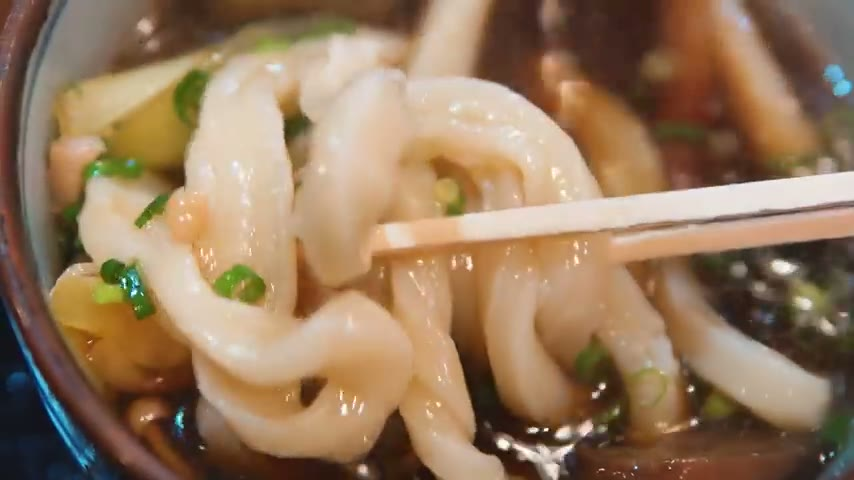
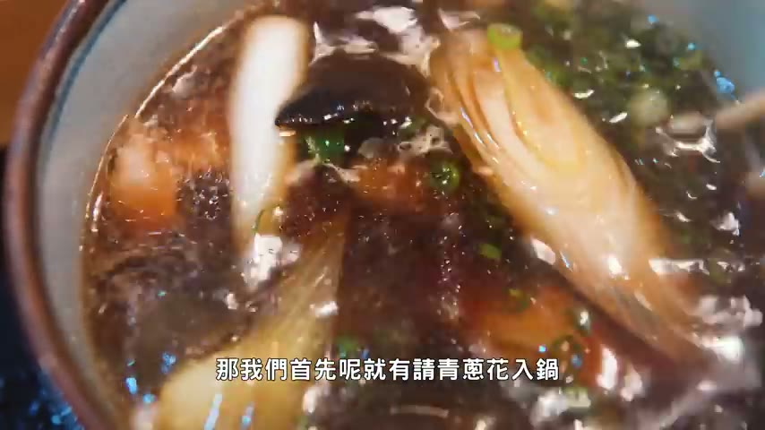
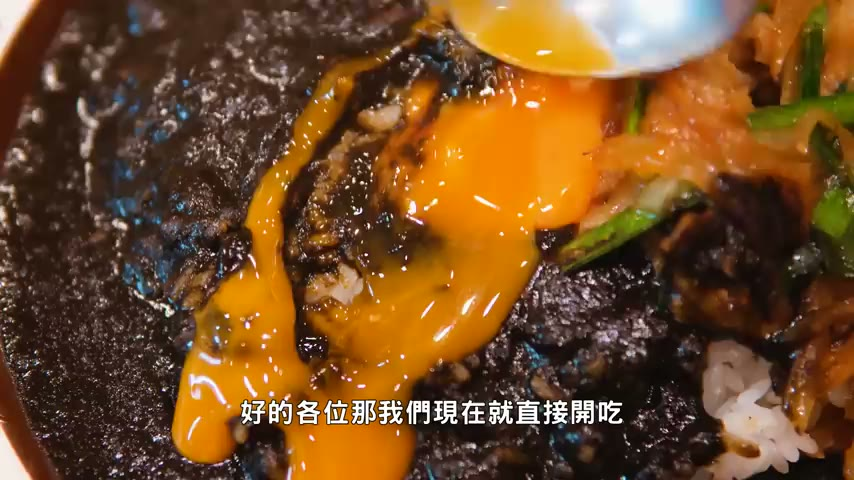
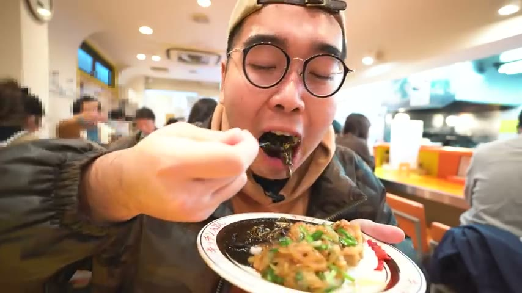
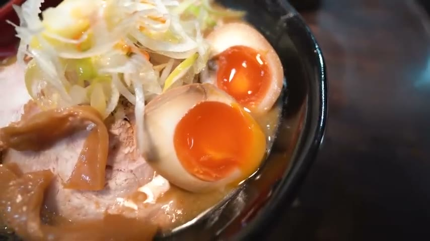
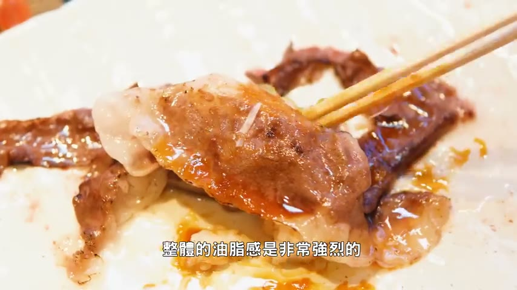
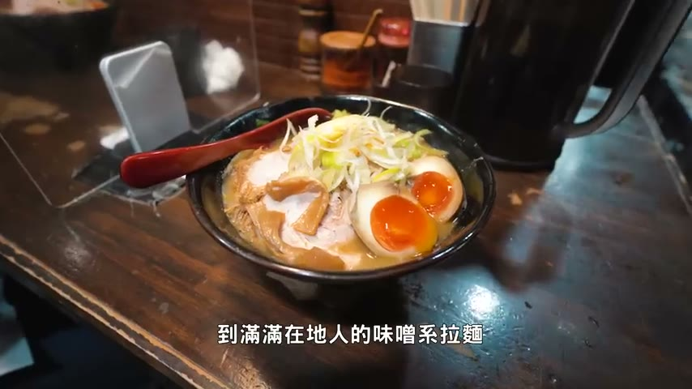

# 東京美食池袋篇：24小時爽吃五選

> 原始影片：https://www.youtube.com/watch?v=EWSRymVMMuo

## 目錄

- [開場介紹](#開場介紹)
- [無敵達德哥（烏龍麵）](#無敵達德哥（烏龍麵）)
- [Kitchen ABC（洋食咖哩）](#Kitchen-ABC（洋食咖哩）)
- [麵屋糊塗 & 麵廚花田（拉麵）](#麵屋糊塗-&-麵廚花田（拉麵）)
- [回轉壽司 活美的利](#回轉壽司-活美的利)

---

## 開場介紹

### 開場：池袋美食24小時爽吃特集

`[0:00]`

嗨大家好,我是菲波 今天有个各位的来的是 冬京美食吃代片 二十四小时 爽子特集无选 分别是无期达德哥 Kitchen ABC 面屋糊涂 以及面厨花田 最后是回转手食的活火美的力 好,这个位 那我们现在就直接开始

---

## 無敵達德哥（烏龍麵）

### 第一站：無敵達德哥 — 手打烏龍麵介紹

`[0:19]`

好,这个位置的朋友首先第一站 我们就来试一下来自于 七月讯的屋东名店 他就是无期达德哥 商笔我们叫常见机器分析的路线 他们家有一个手机刀落 人工切法 所以说面体看起来会相对比较不规则 但同时估计是更加的Q彈

---

### 鴨湯冷沾烏龍麵品嚐：Q彈麵體與鴨湯風味

`[0:36]`

那我的呢就是他的鸭汤冷占屋东 好的各位,那我们现在就直接 来自于这个位置 然后我们现在就直接 来自于这个位置 然后我们现在就直接 来自于这个位置 然后我们现在就直接可以吃 我们首先呢就有请青春花入锅 然后呢再稍微给他搅拌搅拌 因为我看到都是纯粹的 比如说三样你葱花之类的 鸭汤的版本还真的是相对少见 不过主角呢 估计还是我们的面体本人了 入口最明显的 最绿色的他飞笔形上的Q进搅感 进到感时主通时呢又很粗 所以就举举起来是相当有感的 而且他的湯头本身呢 感觉还漂浮一点 烈烈是鸭油的元素 所以说呢就会在微霆的降底 还有大重的甜味之外 铺上点淡淡明源的优伤 而且他里面除了鸭肉以外 好像还有加入鞋子 不过他面体的粗度 真的是没有到那么好夹 里面鸭肉的嫩度之外 就是不要不要紧紧 所以主要呢 还是让他非常特色的面体 估计时主的角感来carry 而且你看的在湯是汤汤的 就是说冬天吃起来也是蛮舒服的

---

### 總結無敵達德哥：口感最Q彈的烏龍麵

`[1:54]`

好的各位 总结也能无其他给个 也是属于种还没有开一点 就会拍很多人的类型 像就有火力死主的风味 真的就是一口口感来经验你 同时呢也觉得是我目前来日本 拍过口感最Q弹的一下子的农面 好的 我们现在就接往下来

---

## Kitchen ABC（洋食咖哩）

### 第二站：Kitchen ABC — 平價洋食咖哩專門店

`[2:17]`

好 这个棍子朋友 我记得下来站 我们就要试一下 我一会在吃带冬口 这边的平价杨石专门店 它就是Kitchen ABC 也是属于种在地人 非常多的排队名店 然后我记得呢 就是他们家的招牌 江苏猪肉桌黑咖哩 两种是下饭神器一份通包

---

### 黑咖哩與薑燒豬肉飯品嚐：下飯神器組合

`[2:34]`

好的各位 那我们现在就直接开吃 首先呢就熟到在黑咖哩期手 看我在复杖客预子 来收一下 香醉我一曲中的甜味 其实更多的还是足重一个咖哩香 同时委员的预会在带上 连适当的唯辣 以及它预子非常显著的鸡蛋香汽油 之前呢 就是一个了日系 日色杨石的Fuel 你可以感受到那种农厨的咖哩酱 包括它Kitchen的米饭 黑咖哩吃完呢 再来就是一下隔壁的江苏猪菜猪 咱们把锡肉准备了 江苏猪菜猪 咱们把锡肉准备了 什么味道 OK 香酪的味道 香酪的味道 香酪猪肉 就可以感受到更加突出的甜味 而且你们的洋葱呢 也是炒到比较软明的汁地 最后呢就来个混合吃法 江苏猪打配上黑咖哩 画面看似混乱 但结合在体积率是极度的下饭了 好的各位

---

### 總結 Kitchen ABC：感受日系洋食魅力

`[3:33]`

总结也能Kitchen ABC 绝对是你给我来到吃的 要感受下次是洋食面里的幼稚选择 好的 我们现在有接往的菜针

---

## 麵屋糊塗 & 麵廚花田（拉麵）

### 第三站：麵屋糊塗 — 清爽風格拉麵店介紹

`[3:51]`

跑这个滚的朋友 记得下一站 我们就来试一下吃带地区 在塔北路上的朋友 一拉一门店 它就是面糊糊 真体呢 左右一个非常特别 轻松优弦 下午一风格路线的拉面店 我记得呢 就是它的降游搜吧 然后你只要点拉面 它都还会在附上 颁的饭团 刚才在等面的时候 已经透出了一口 好的各位 我们现在就直接开始 我们首先呢 就从它的面体起手 走这种细面路线 然后呢 还有在搭配上慢慢的绿豆芽 以及损干

---

### 麵屋糊塗細麵品嚐：輕而不淡的風味層次

`[4:24]`

我觉得日本这边的 厉害的拉面店 都有的共通点 即使它当头色的看着也很轻车轻淡 但你纯细面 就可以看收到非常突出的存在感 除了是它的降伤看甜之外 感觉呢又多了一点 历史又子的风味 真的就是轻而不淡 同时呢 可以感受到很明显的风味层次 我们配着上它里面的 绿豆芽水下 配着上绿豆芽一起吃 清爽感的质任 就是再度提升 同时呢 又会在附上脸脆脆的口感哦 最后呢 就以它的叉烧说为 有一种几乎要瓦解 非常易碎的感觉哦 虽然说只有一小块 但是真你的爽度 就就是很够的 不是看它的油脂香气来真复逆 而是透过它的调理方式 让它有非常软面易碎的脂底 最后呢就以我吃了一般的 Spanel饭团收尾 因为里面都还有在加入点腌菜 所以说吃起来就不会说过干啦 同时那种腌制的香气 也很有效的 跟这种冠状活腿的咸味 这个铭痕哦

---

### 總結麵屋糊塗 + 第四站：麵廚花田濃郁味噌拉麵

`[5:32]`

好的各位总结 也能面务糊涂涂 想要感受这种清爽的细 还好风拉面的话 选它准备错了 好的那我们现在就先往下针 好 这个如果你的朋友 清爽时的拉面吃完 我们做来点农户式的味噌拉面 它就是在吃在东口 上面的面取花钱 茶边的屏分 够达3.73 味具实在的防二

---

### 麵廚花田叉燒與味噌湯頭品嚐：暖心濃郁

`[6:01]`

我觉得就是肉酱最多的版本 除了满满的猪花 超烧之外 还有茶上满满的葱花 以及一颗糖心蛋 好的各位 我们现在就直接开始 首先呢就来清楚一下 表面的猪花超烧 夹起来也是非常容易 睡烈看来啊 上个一睡的子弟感受一下 咱论茶烧的口感 香米前加胡椒 和黑头它一条 受味的部分依旧是非常地软 每一睡 只不过呢 它用的是五花嘛 所以说那种油脂肪 眉密感 还有油香氛围的 就更加的足处 同时呢又会在铺上点 好 我为了甜味酱香啊 茶烧吃完呢 我们昨天可以来进攻面积 而且它跟那个嘴脊棒一样 豆芽好像都是现场快炒的 要不可以的 啤酒胶感 假如稍微出面就真是很难了 同时呢又在铺上它 里面的损甘呢 轻松花的一点脆度 同时你吸入口中 在浓厚的味增香之外 是可以感受到 非常显出的甜味底涵 不是那种它味度不限哦 对说入口喝起来是很舒服的 最后呢就以它的糖薰的收尾

---

### 總結麵廚花田：冬天必吃味噌拉麵首選

`[7:14]`

好的各位 总结也能面属花甜 就是你这位在冬天 想要感受一下 暖心两位 味增拉面的柚子选择 弄得不过头 喝起来方位是很顺口的 好的 老闆 现在就先往下针 再来一会儿 再来一会儿 再来一会儿 再来一会儿 再来一会儿 再来一会儿 再来一会儿 再来一会儿 再来一会儿 再来一会儿 再来一会儿

---

## 回轉壽司 活美的利

### 第五站：活美的利 — 池袋回轉壽司體驗

`[7:39]`

好 这个给你的朋友 最后这样 我们就来一点日本的 米果比较环节 那就是爽吃的回软壽司 这一间呢就是会在 西午晚一户巴楼的火美的历 虽然说台湾现在有美的历啦 但是回软的版本 个人还真的是没有试过 好的 那我们现在就直接开吃

---

### 各式壽司品嚐：飛魚卵、和牛炙燒、味噌蝦

`[7:54]`

那我们首先呢 就从飞翼上去到的新闻起手 只喝台湾差不多是不到150块 这个铁村小一头几点 但是就是高点度 不过重点是即使它非常的大坑 口感上还是几度的眉密的 我们把它整块爬掉 本来在拍我的海浪 结果的巨大牛肉蒐丝端就来了 比例彻底的撕痕啊 嗯 绝对不是意思 稍微至少一下的牛肉蒐丝 整个油脂感是非常强烈的 同时呢在油香之外 比上点微人的降低 牛肉吃完呢 就来吸一下味噌海浪 后果它表达0上去的味噌酱 终和一下这一种虾味 不过重点是新鲜度绝对是很有保障的啦 虾肉本点还是把我那种 滋潤度十足的瓶浆奶呢 再来呢就来一个精联款 葱花不如大富 不过说实在呀 它的米粉还是有那么一点 人要挖起的 生骨我觉得整体偏普 我看到表称 我们就知道油花比较客气 同时呢它又補上了点 加末在上面 因为在度中回来 它的油脂风味 再来呢就是一下 自上三块的左海软酱 吃的出来它是海软奶油酱 海软的存在感 自然不会特别突出了 主要呢真的还是一股淡淡的奶油香气 不过个人呢是非常期待它的精幕标啊 精力标准备起来 那种Q进口感 就是比较突出的 尤其是它有代皮的地方 然后呢也是属于这种 清爽气的油脂风味啦 泡的锅也呢

---

### 結尾總結：從烏龍麵到回轉壽司的池袋美食之旅

`[9:37]`

以上呢就送我们这次的 东京美食 迟代片二十四小时 爽气特几无悬 从Q到不行的乌龙面 到满满在地的味珍系拉面 最后呢以一场 回转说说 所谓的香 油脂 回来到迟代完的时候呢 从不可以考虑一下 好的那要这样啦 想去的点家资讯 我一样呢会精力的 放在影片下方的小伙伴 感谢各位的收看 然后我们就下部影片见 拜拜

---

