# 東京美食中目黑篇：爽吃四選

> 原始影片：https://www.youtube.com/watch?v=UmzMmn1A8uQ

## 目錄

- [開場介紹](#開場介紹)
- [炭火燒まる（鵝肝親子丼）](#炭火燒まる（鵝肝親子丼）)
- [聖林館ナポリピッツァ](#聖林館ナポリピッツァ)
- [中目黒散步與星巴克](#中目黒散步與星巴克)
- [屋台餃子 安倍味](#屋台餃子-安倍味)
- [Beef Kitchen 和牛燒肉](#Beef-Kitchen-和牛燒肉)

---

## 開場介紹

### 開場：中目黒美食24小時四選介紹

`[0:00]`

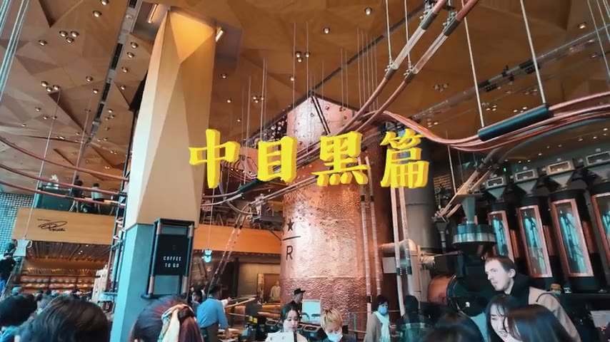

嗨大家好,這是肥波 今天要來過一點來的是 東京美食中模黑偏24小時爽著特級四選 分別是炭火燒麻糬 拿不過的披薩森林館 以及烏臺風餃子安賓味 就是喝牛燒肉百名店Beef Kitchen 好的各位 那我們現在就直接開吃

---

## 炭火燒まる（鵝肝親子丼）

### 炭火燒まる：肌肉料理專門店介紹

`[0:30]`

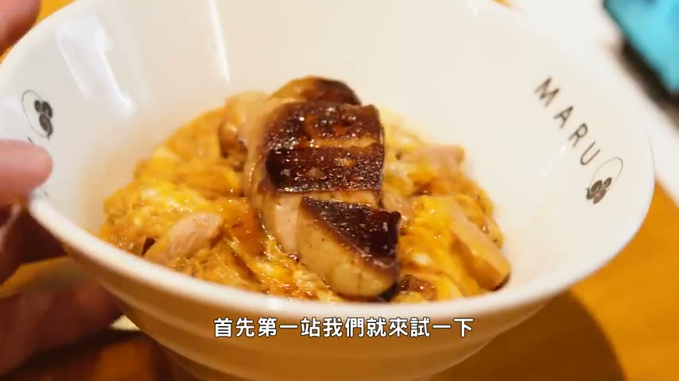

好,各位觀眾朋友 首先你一講 我們就來試一下 開在中午黑車站附近的 肌肉料理專門店 它就是炭火燒麻糬 主打的可是一種叫做 天朝大王雞的雞 聽說是全日本體型最大的雞種 來到這邊就可以測到各種 以它做的料理 像是我點的特上青子凍 然後是搭配上一碗濃厚雞白糖拉麵 不過最特別的 覺得還是這個青椒肉絲 熟悉的名字 但是那是完全不一樣的 青椒打底搭配上生的雞肉 然後表面還有放上一顆 提燈的燈籠 看起來有點哈扣啊 遞到開胃菜

---

### 青椒肉絲（生雞肉＋燈籠蛋黃）品嚐

`[1:05]`

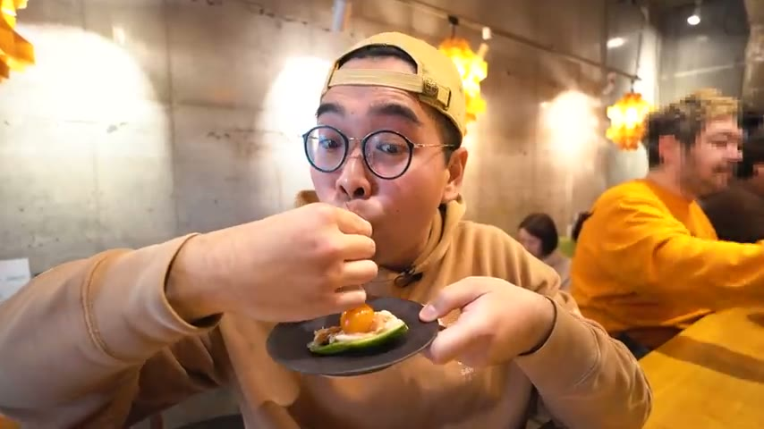

來收一下 整隻日口的口感 就算就是極度豐富 有它青椒雞裡的鮮脆 中心香入滿滿 雞肉的軟嫩度 隨著人取決咬爆蛋黃之後 一口咬爆蛋黃 隨著人取決咬爆蛋黃之後 一口咬爆蛋黃之後 它有濃純的雞蛋香 就會噴發出來 不過調味其實不會說特別的重 主要真的還是蛋黃的香氣 跟青椒的那種水潤清香感 生雞肉意外的 其實沒有什麼太的味道

---

### 雞白湯拉麵品嚐

`[1:42]`

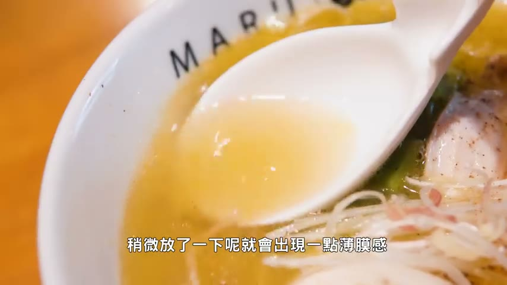

再來下一道就是 它的雞白糖拉麵 湯頭的濃鬱度看起來是非常可以啊 稍微放了一下 就會出現一點保抹感 喝起來真的就是一個很純粹的 雞排湯湯底 同時又帶上點 鹽味的鹹香尾韻 而且這碗只要1100日幣而已 再來就是一下它的麵體 Q度那絕對是充分到位 同時吸入口中可以感受到 雞湯的油潤感 包覆它軟Q的麵體 結合在一起 但是需要能夠刷碎 再來一口雞叉燒配麵 叉燒本身的口感 那個也是充分的水潤 不是屬於徹底糯米 還太有一點小肉的口感 我覺得就很像是一碗 家常乾拌拌的雞白糖拉麵啦

---

### 特上鵝肝親子丼品嚐

`[2:36]`

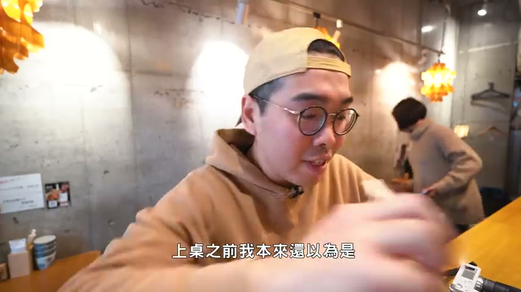

最後就以我們的特上 親子的收尾 上桌之前我本來還以為是 雞肉配雞肝 但結果它又是鵝肝 搭配上打底滋潤的滑蛋 來一個又是一個 很特別的味道 先來一口滑蛋 首先這樣雙的方面 那就是我的菜 前香為主帶一點甜 同時保有非常優秀 伴手滑蛋 之後再Q的質地 重點是它鵝肝的口感也是很猛 表面烤得微脆 但是中性還是 抓得非常的綿密 彈化以後就會補上乳乾味 跟雞蛋香氣交往在一起 確實有料 而且它裡面的雞肉塊 用的還是有帶皮的部分喔 所以說那種油香風味 就會變得更濃厚 那當然這種青椒凍 米飯的口感就比較偏向濕潤一點啦 主要還是吃一個濃稠的這樣 還有雞蛋的風味

---

### 炭火燒まる總結評價

`[3:33]`

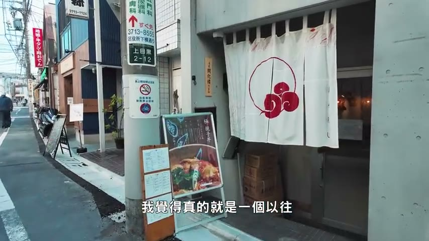

好的各位總結也呢 炭火燒Maru 我覺得真的就是一個 以往從來沒有體驗過的 雞肉料理 特別是它的青椒肉絲 不過那個我覺得還是 吃一個新鮮新奇 不過青椒肉 絕對是相當的有料 來到中暮黑 有機會可以嘗試一下 好的 那我們現在就前往賽站

---

## 聖林館ナポリピッツァ

### 聖林館：Napoli披薩專門店介紹（食べログ3.70）

`[4:04]`

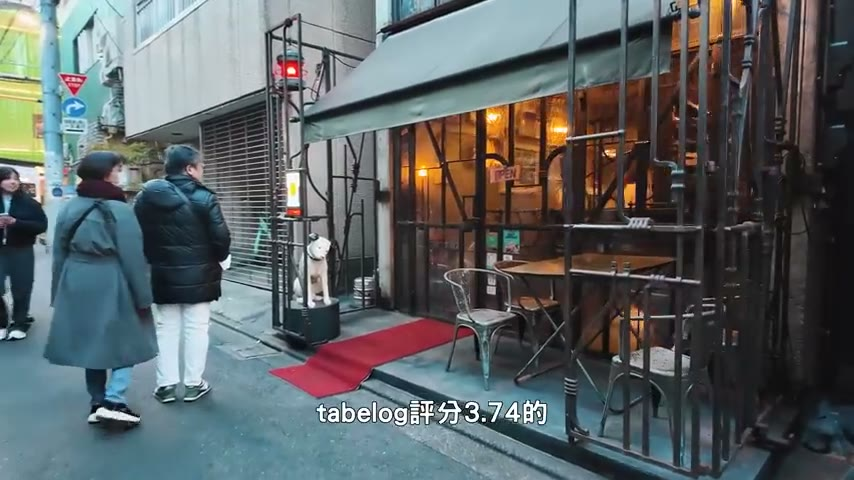

好的各位觀眾朋友 記得賽站 我們就來試一下 中暮黑披薩大地 它就是聖靈館 它被落個評分 3.70的Napoli披薩專門店 那我點的呢 就是經典中的經典 馬格利特 搭配上馬伊娜拉 單吃兩份那是相當合理 那我們首先呢 就從馬格利特起手 這種非常道理的Napoli披薩 好像就是要用刀子切來吃啊 我有預感 就會刷清我對於 Napoli披薩的認知 連段你不輔助一下 真的是會垂下去

---

### マルゲリータ（瑪格莉特披薩）品嚐

`[4:30]`

入口你可以感受到 它的表面那真的就是極度濕潤 感覺是因為它的感染 有比較多 同時番茄你也很多 它配上它餅皮 濕潤且軟Q的膠感 而且吃起來 真的就是很簡單純粹 番茄的酸跟起司的奶香 能夠把最簡單的 馬格利特披薩 做到這種水平 那絕對是高手 絕對是本頻道 至今拍過最強的馬格利特 看它這個下垂的多汁感 就知道了 我們來一片對折起來 兩片對折夾起來的那種 QC感也會再更加強烈 同時感覺它底部的那種 焦香也比較突出一點 淡淡的微苦 跟它的酸香 還有起司味焦濃在一起

---

### マリナーラ（水手披薩）品嚐

`[5:24]`

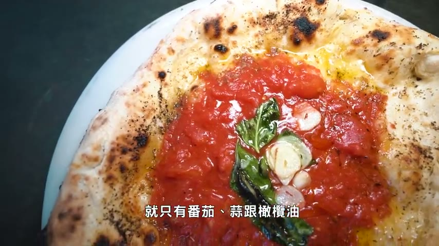

再來下一款更加純粹 水手披薩 馬力娜拉 就只有番茄酸跟橄欖油 聞起來那是非常的香 我發現直接切個大約 兩片的量 把它們對折在一起 吃會更方便 雖然我個人 還沒有去過拿Poli 但我覺得這個估計 是非常接近了 嗯 嗯 少了起司番茄的酸甜感 就會變得更加強硬 咬到蒜片呢 就又再帶出 一股更加濃厚的 蒜香風味 而且我覺得它的 麵糰真的是有 撒一片鹽巴 你是可以吃到一點 顆粒感的喔 嗯 吃的時候真的要 稍微小心一下 不然裡面的番茄 還有橄欖油 真的會噴發出來 嗯 純粹它邊邊的地方 口感也是很好 軟Q帶脆 同時它有一點 鹽巴的香氣

---

### 聖林館總結評價與店內參觀

`[6:15]`

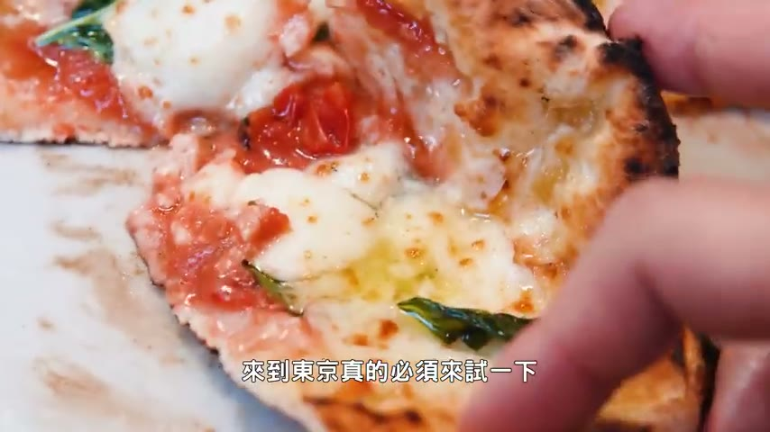

好的各位總結人呢 拿Poli Pizza是領館 我只能說 如果你喜歡吃這種 水溫帶Q拿Poli Pizza的話 來到東京真的必須 來試一下 而且它的店面 長得超酷 這是它 地下室廁所的地方 走一個極度重工業風 來各位走樓梯 上去看一下 那個師傅 有點危險啊這個樓梯 好 謝謝 謝謝 謝謝

---

## 中目黒散步與星巴克

### 中目黒川散步：最想居住地區的魅力

`[6:44]`

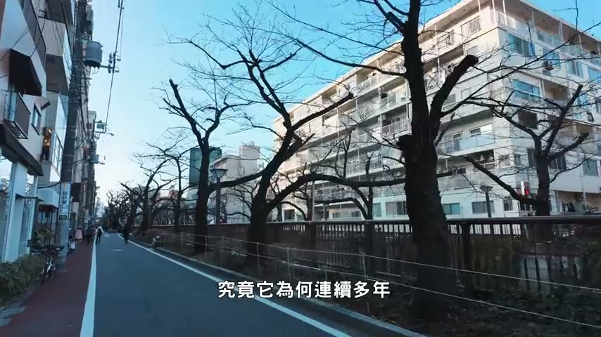

好的那我們現在就前往上一站 吃飽帶各位來 中黑的街頭散步消化一下 究竟它為何連續多年 都被票選成為 最想居住的地區 中間這一條木黑船 估計就是主因啊 雖然說現在看不出來 但是這兩側 重的全都是極野鷹 等到之後 櫻花季開始覺得是不得了

---

### Starbucks Reserve Roastery 中目黒店介紹

`[7:04]`

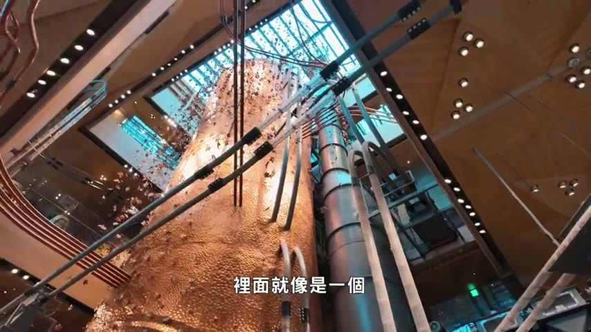

前面還有一間 全球唯六 Starbox Reserve Roastery 星巴克徵選工坊 裡面就像是一個 顏值超高的 巨型咖啡工廠 從烘焙咖啡豆 到你手上的咖啡 仔細看電話板 還有咖啡豆的舒松帶 總共四層樓 每區都可以點餐 所以平日來 其實也不用等太久 品項除了咖啡之外 還有雞尾酒等等 另外吃的也很豐富 三樓戶外區 之後還可以邊喝咖啡 邊賞飲 吃著抹茶提拉米書 喝著櫻花咖啡那題 絕對是你各位 來到中黑的必備星辰

---

### アマゾネス（生麵團甜甜圈）試吃

`[7:38]`

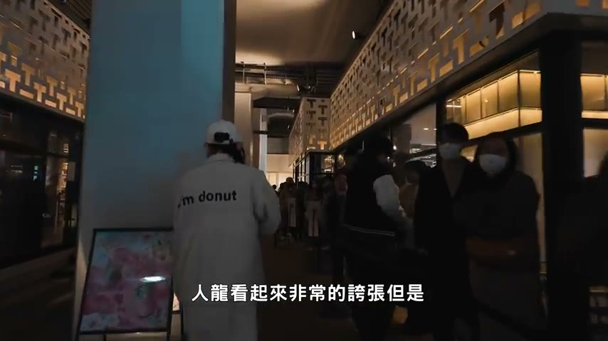

加碼幫各位試吃一下 中黑車站下面 排到黑頭的Amazoner 人龍看起來非常的誇張 但是其實也大概 等個20分鐘就有了 他們家主打的 好像是生麵團 確實那種腳感方面 就會比較強烈 再來一顆原味的版本 蓬鬆帶Q 腳起來滿特別的 我覺得就是一個 排個20分鐘還可以接受 但如果你是假日來 一個小時的話 可以跳過 散步消化消化 晚餐場繼續開吃 我們待會見

---

## 屋台餃子 安倍味

### 屋台餃子 安倍味：來自日本高知的餃子專門店介紹

`[8:24]`

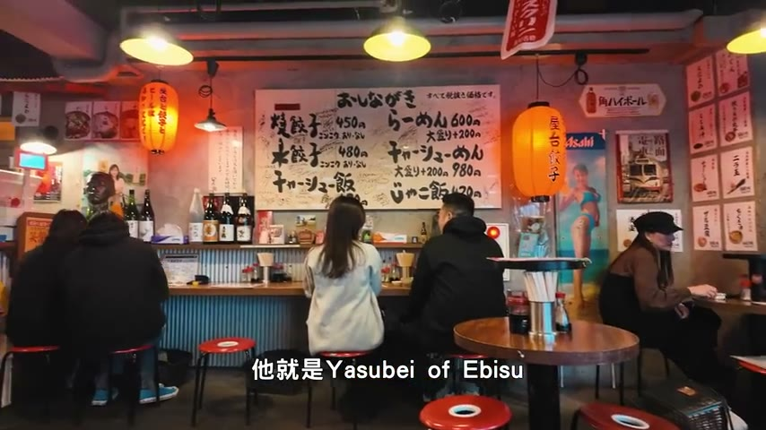

好 各位觀眾朋友 下午場我們來試一下 位在惠比壽站附近 來自日本高知的 烏臺風餃子專門店 它就是 Yasobi of Ebisu 我個人其實 從來沒有在日本吃過Q 而且生意真的是非常好 收入了下午3點 日本人就已經開喝了 那我們首先 就從雜的版本起手

---

### 炸餃子（酥脆雲吞皮）品嚐

`[8:42]`

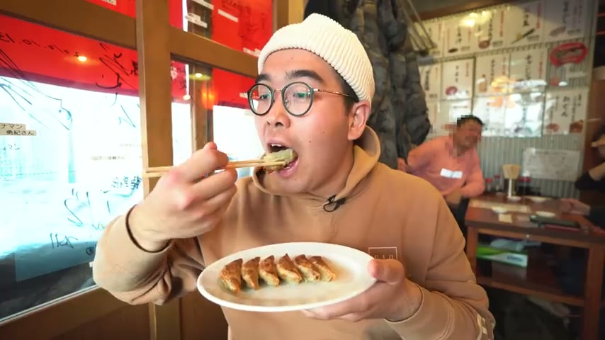

底部夾起來是非常的酥脆 但是路外面翻過來 卻保有的像是 真腳般的精英聽透感 從我這個口感 個人就是雞吞 你可以嘗試一下 不像我們熟的 鍋貼皮比較厚 真的是近似 雲吞紙一般的薄脆感 但卻能夠 非常完好的 它的肉餡給保護在中心 口感上非常特別 雖然說純粹內餡的風味 真的就是 淡淡的肉香配上點 高麗菜的甜味 正確吃法 估計還是要 鹿上醬汁才對 鹹香非常突出的醬油 配很有效的輔助下 它淡淡的 內餡肉香風味 來一塊淋上辣油的版本 有點像我們在臺灣

---

### 五花叉燒切盤搭配黃芥末品嚐

`[9:29]`

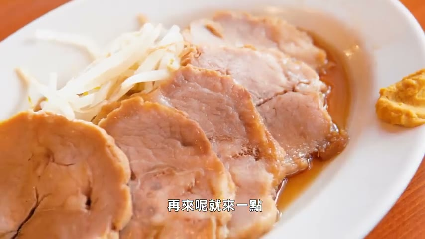

吃牛肉麵 會加了辣牛油 不是純辣 還會帶上骨 很香濃的油香風味 再來就來一點 烏臺風下腫菜 五花叉燒肉切盤 太四受 但是軟硬的腳感 還是很浮豬的 同時能帶上骨 鮮香為甜的醬油感 我們來一片 搭配上黃芥末 試一下 日式黃芥末 三香帶點香 可以很有效的 解一下五花叉燒的油脂感 純潤這個腳質跟叉燒肉 我覺得就非常值得你來試一下了

---

### 水餃（薄皮軟Q）及竹輪品嚐

`[10:06]`

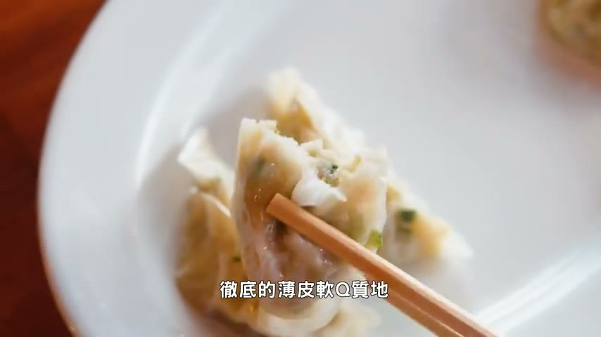

再來呢 去試一下水餃的版本 水餃版本 就是一個徹底的 薄皮軟Q質地 然後他們這裡吃腳質呢 都還會再附上一碗湯 變成一碗自製水餃湯 這種超廣的外皮 泡在湯裡 吃真的滿像是混潤湯的 同時你喝了出來 它的湯頭基底 又帶了一點 坤布香氣 最後呢就是小花竹輪收尾 在極度鮮水的小花表面 包覆上了一整魚漿的拼度 吃起來真的就是一個 清爽型的開胃前菜啦

---

### 安倍味總結評價

`[10:41]`

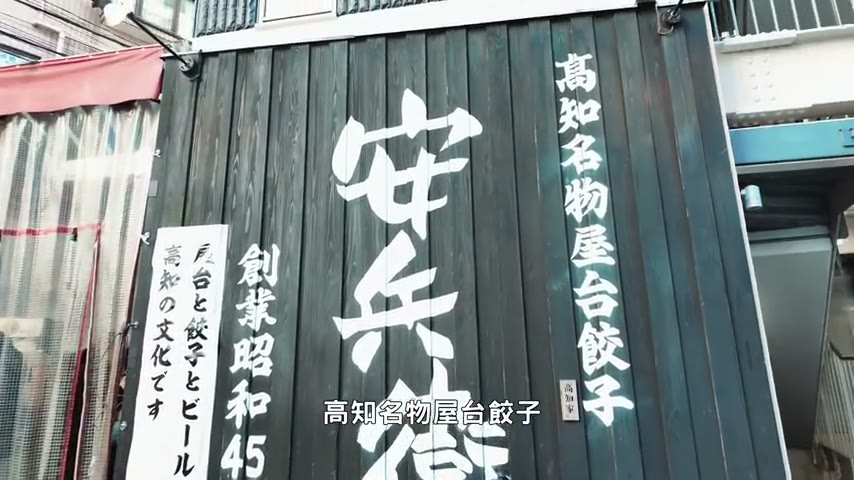

好的各位總經驗呢 有Sopa of Epiz 這很適叫做安賓味 高汁明乳屋臺的腳子 我個人呢絕對是雞推 尤其是那個口感 而且我看他們現場 都是線包線做 所以說不是那種 冷凍丟下去炸一炸而已 好的那我們現場就前往賽站

---

## Beef Kitchen 和牛燒肉

### Beef Kitchen：和牛燒肉百名店介紹（套餐6400日幣）

`[11:02]`

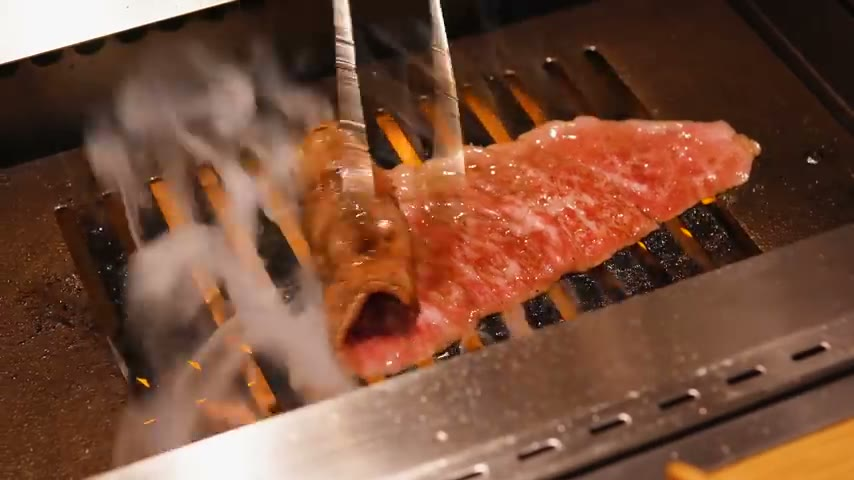

那我們最後一站呢 就來試一下東京和牛 燒肉百米店之一 它就是位在 中木黑這邊的Beef Kitchen 算是中間價位 套餐一個人差不多是6400塊 日幣 所以說不到臺幣1400 首先的一道呢

---

### 生和牛塔塔品嚐

`[11:25]`

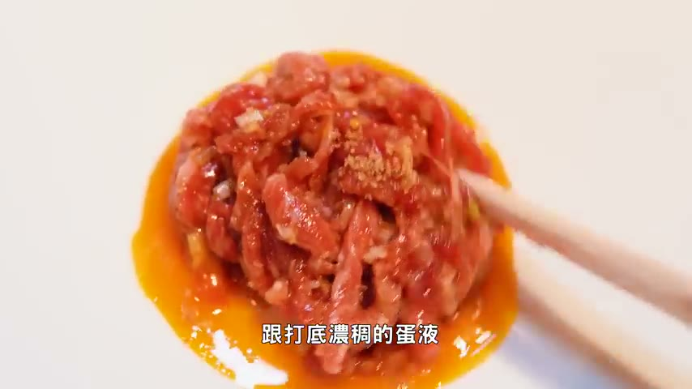

就是合法的 生牛肉塔塔 好像在日本有些地方 是不能賣這種 生的和牛塔塔的 跟打體濃稠的 帶一種充分的 攪拌攪拌 以五燒肉這樣的甜味為主 同時呢又在補上點 解膩用的洋蔥 在它軟滑軟滑的 生牛肉口感之外 焦脆一點 細細色色的脆度 再來下一款呢

---

### 厚切牛舌與橫隔膜燒烤品嚐

`[11:48]`

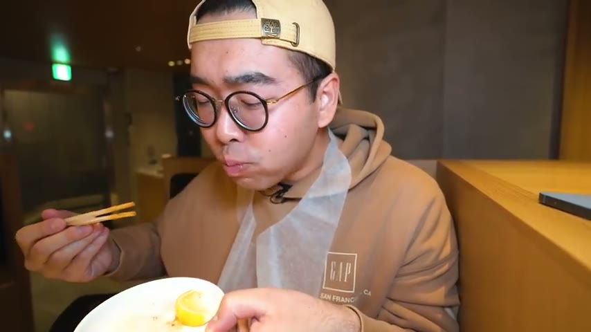

是後切牛舌 擠上一點檸檬呢 就可以開吃 表吹內Q 嚼感是非常的好 而且呢因為它是 帶有硬厚度的 咀嚼起來這種嫩Q感呢 就會格外的突出 透過檸檬的一點 酸香風味 把它的肉質香氣 再更加的帶出來喔 在日本吃牛舌 就是特別爽 厚 但是不會說太貴 再來這一片呢 是橫格模的部分 這麼大得是一口吃的嗎 純粹要稍微咀嚼一下 它的肉感 同時肉香的風味 越來越比它的牛舌 再更加突出 再來下一款呢

---

### 肋眼星（五分熟）與炸牛夾肉餅品嚐

`[12:26]`

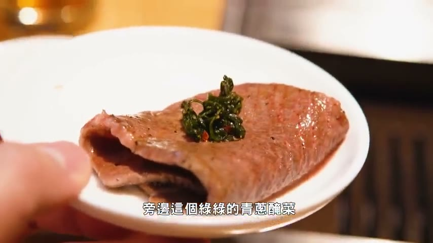

是樂眼星的部分 然後抓的是 五分熟 建議搭配上旁邊這個 綠綠的青蔥煙菜 也是屬於極度厚切的 從側面看 嚼感比較偏向直上直下 我有太多那種 濕扯的口感 同時油香風味呢 也會再更加濃厚一點 再來這個很特別喔 炸的牛夾肉餅 跟它底部的這樣 是充分的來啦 聞起來很像是 羊屎會配的那種紅酒醬 吃起來就很像是 燉煮的極度軟爛的牛夾 塑形成一個小方塊 然後再拿去炸 所以你感受到的真的就是 四方的薄脆跟中心 極度平面的質地 同時在濃厚的肉香之外 包覆上了紅酒的香甜尾韻 再來下一個呢是叫做 CLEE的補微

---

### 本日特選部位與燒肉醬厚切牛肉品嚐

`[13:13]`

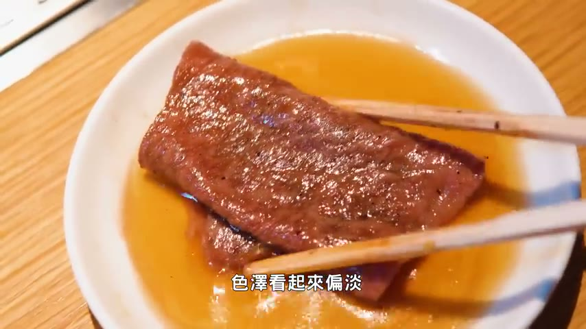

另外的話就是 牛尖夾的部分 然後這一款呢 就要露上它比較燒肉醬 色澤看起來偏淡 而且很滋潤的感覺喔 嗯 成潤口感的話 個人喜歡這個 可牛油汁的奶油感出來了 同時呢 它又足夠大片 堆疊在一起 入口的爽度 真的是很高 隨著那舉絕呢 濃醇的油香 就會跟它醬底的微甜 融合在一起 再來這個呢 是本日特選部位 厚度很明顯 是目前最強 他們家的肉片 都是走一個 相當大片切的路線喔 這一口真的是不得了 雖然說它極度的厚切 但是軟嫩感

---

### 燒版壽喜燒沙拉與冷麵、冰淇淋收尾

`[13:56]`

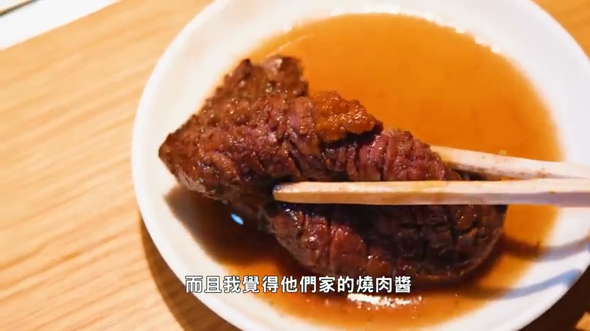

也絕對不會輸給 前面幾塊 屬於可嚼 但是不會說過Q 而且我覺得 他們家的燒肉醬 真的是滿對我的味的 不會甜聞味的甜 去平衡一下 整體的油脂感 最後呢就是 今天晚上的重頭戲 瘦起燒版本的劇情沙拉 前幾個禮拜在大灣 也有看到這個組合 油脂感絕對是超級豐富 烤的時候完全是 發爐的狀態 嗯 表面薄脆 整體極度的油潤 同時呢又會在包袱上 蛋液的滑順滋潤感 隨著你咀嚼的油香 雞蛋香 還有表面那種 塑魚燒醬香的甜味 就會融合在一起 絕對是 非常最爽的一個組合 最後呢還會有一個 冷麵收尾 口感相當的就是 你想要把它咬斷 也咬不斷的Q勁 同時呢湯底 可以感受到泡菜的酸甜 跟一點蘿蔔的清香 很有效去綜合一下 你前面吃的一大堆 油滋滋的和牛肉片 飯後甜點呢就以 冰淇淋最終收尾 感覺是奶茶冰淇淋 茶香非常濃鬱 同時呢又帶一點 奶燒的尾願

---

### 結尾總結：中目黒美食四選回顧與推薦

`[15:14]`

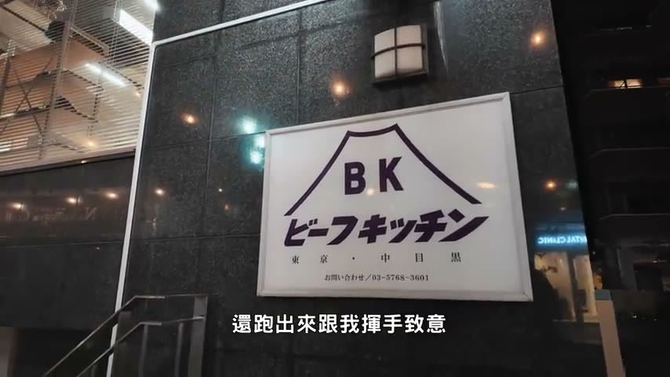

OK各位 吃飽出來了 剛才老闆跟幫我烤肉的 小姐姐還跑出來 跟我揮手自已 相當的友善 1400塊 想要在臺灣吃到這樣 水平的和牛燒肉 基本上是沒可能 其他其實跟大會一樣 就是沒什麼花樣 真的就是純粹的 吃肉配酒配飯 有機會可以來嘗試一下 好的各位 那以上呢就是這一次的 東京美食 中目黑片24小時 爽的特級四選 這世家裡面 個人絕對是 手推 拿潑裡披薩森林館 那個濕潤度 還有非常驚人的腳感 真的是深得我心 好的那就這樣嗎 讓大家一起陪我 就去中目黑車店搭車 詳細的電牙資訊 我都會放在 影片下方的說明欄 感謝各位的收看 那我們就下部影片見 掰掰

---

